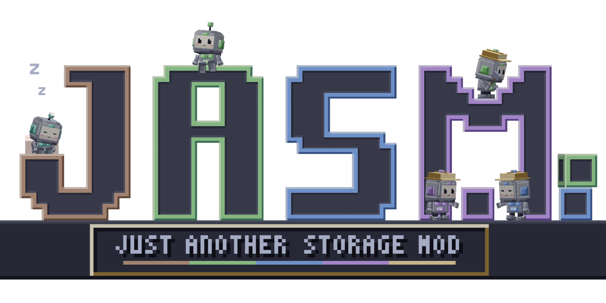

  

<b>Just Another Storage Mod</b>: portable, recoverable digital storage for Minecraft.

---

> [!WARNING]
> JASM is still in **beta**. It works, but it's young: things can break, change between versions, or behave in ways I haven't caught yet. Found a bug? Open an issue and I'll take a look.

JASM stores your items as data on small chips called wafers. Carry them around in a handheld Deck, and back them up at an Archive, so a lost wafer can be rebuilt instead of gone for good.

Read the [guide](https://micolash54.github.io/JASM/) online, or craft a JASM Guide in game from a Book and a Data Crystal.

## Features

- **Capacity Wafers**: storage chips in seven sizes, from Basic up to 1M. The last two need Synapse Cores.
- **Type Wafers**: hold only a few kinds of items, but lots of each. Seven sizes, from 4 types up to 256.
- **Synapse Cores**: built from Advanced chips and a Data Crystal by a Byteling in the Chip Workshop, and the key to the two biggest wafer sizes of every kind. Upgrade a wafer like any other and what it holds comes along.
- **Fluid Wafers**: the same two kinds of chip for fluids. Fluid Capacity Wafers come in seven sizes, from 256 buckets up to 1M; Fluid Type Wafers hold 2 to 128 kinds of fluid, each in bulk. One bucket takes the room of one item, and every 125 mB moved costs what one item costs. They go in any Deck slot, and the Deck's grid shows items and fluids together, with a button to show only one. Right-click the grid with a full bucket, or shift-right-click it in your inventory, to pour it in. Click a fluid with an empty bucket to fill it; with an empty hand, a bucket is taken from your inventory, or else from the Deck. Input and Output Ports move fluids too, sharing their speed with items. Fluid wafers work with Archives like any other wafer.
- **Decks**: handheld readers that hold several wafers at once, with a searchable storage screen. Five tiers, from Starter to Ultimate. The battery pays 1 FE for each item moved in or out; browsing is free.
- **Linked Decks**: every Deck can link to a network at an Encoding Terminal, to receive port deliveries and see the Network tab: every machine on the network, as a list or a branching tree, with where it is and whether it works. Autocrafting stays on Crafting Decks. A new Crafting Deck links itself to the network of the Encoding Terminal you used last; any other new Deck does so only when you have no linked Deck there yet. Its tooltip and screen show whether it is linked.
- **Dimension Upgrade**: Decks work only in the Overworld until upgraded. Install one to use a Deck in the Nether, End or modded dimensions. Linked ports, crafting jobs and rules pause when the Deck or its network is outside the Overworld without the upgrade; the upgrade slot stays accessible.
- **Wafer filters**: right-click a wafer in the Deck to edit its ordered Item, Tag and Mod ID filters (Fluid, Tag and Mod ID on a fluid wafer). Each row can Allow or Deny, be disabled, moved or removed. Wafers without filters accept everything; otherwise the first enabled matching row must Allow an item for it to enter. Wafers fill left to right, and higher Allow rows take space first when several item types arrive together. The same window has an Empty out button that moves everything on that wafer onto the Deck's other wafers, paying the usual charge per item. Nothing is ever voided, so what finds no room stays put.
- **Item ports**: cable-mounted Input Ports pull into a linked Deck, Output Ports push from it, and Input Output Ports do both with output first. Each direction has ordered Item, Fluid, Tag and Mod ID filters. Empty input filters accept everything; empty output filters send nothing. Ports run twice per second while active and check once per second after five idle seconds. Four separate Speed Upgrade slots raise the item count per operation from 1 to 4, 16, 48 or 96 (2, 8, 32, 96 or 192 items per second). Upgrades stack normally in inventory and storage, with one allowed in each upgrade slot. All ports also have a Power Upgrade slot: with the upgrade, they supply FE to the machine they face.
- **Storage Port**: mounts on a cable and lends the chest, tank or cauldron in front of it to the whole network. Everything in it shows up in a linked Deck next to the wafers, marked with a small chest, and can be taken out or put in like wafer storage. Each port has an Item, Fluid, Tag and Mod ID filter, an access mode (read and write, read only, write only) and a priority: higher priority takes things in first, the lowest is emptied first, and wafers go first on a tie. Anyone allowed on the network can use it.
- **Deployment Bay**: places blocks, seeds and fluids from its own grid and tank into the space in front of it, as a player would, or throws items out. A Bitling in a hard hat does the work.
- **Demolition Bay**: breaks the block in front into its own grid, scoops up fluids and picks up items that land on its face. Enchant it like a pickaxe for Fortune, Silk Touch and Efficiency. A Bitling in welding goggles works the laser.
- **Bays** run on cable power and don't take up a machine place. An Output Port fills a Deployment Bay and an Input Port empties a Demolition Bay. Speed Upgrades make them faster, and with a Redstone Upgrade they can also work once per redstone pulse.
- **Archives**: back up wafers and rebuild a lost one onto a blank. Shift-right-click with the linked Deck to back up its wafers in slot order, skipping those already backed up on the network. A short message shows the overall backed-up count. A standalone Archive works for its owner without a Terminal or paired Deck, and links the owner's held Deck automatically on its first backup. On a network it defaults to the network owner, who can select another trusted player's paired Deck. Trusted players can view the backups. Replacing a lost Deck for the same player keeps their backups.
- **Combustion Generators**: burn anything a furnace burns for power, in Basic, Advanced and Elite tiers. Each has a charging slot for Decks.
- **Power Acceptor**: the only way other mods' power gets into a JASM network. It pulls FE from power blocks next to it, takes FE other mods push into it, and feeds touching cables and machines. JASM blocks never take power straight from other mods, and the Acceptor never gives any back.
- **Wrench**: right-click a side of a JASM machine, Archive or generator to turn its front there; sneak and right-click any JASM machine, cable or power block to pick it up at once, keeping what it keeps when mined. Wrenches from other mods work on JASM blocks, and the JASM wrench works with mods that accept any wrench.
- **Crafting Decks**: Advanced, Elite and Ultimate Decks with a 3×3 crafting grid that takes ingredients straight from the wafers and refills itself.
- **Autocrafting**: write recipes onto Recipe Cards at an Encoding Terminal, keep them in Recipe Racks, and let Crafting Servers do the work. Ask for anything from your Crafting Deck, and the ingredients it needs are crafted first. Completed requested items return as each batch finishes; intermediate items stay with the job until it ends. A hammer in the Items tab marks items with a known recipe, even when some are already stored. Processors decide how many crafts run at once, Storage Modules how big a job fits. A job list on the Deck shows every job and opens its server from anywhere.
- **Machines**: put an Access Port next to furnaces, modded machines or a multiblock (every side counts), and write processing cards for it: what goes in, and up to three things that come back. Jobs send the ingredients in and wait for the results to come back into the port. Fluids work too: right-click a slot with a full bucket or tank (or drag a fluid out of JEI) to write it on the card, and scroll to change the amount by 125 mB, or a bucket with Shift. The job takes them from the Deck's fluid wafers and puts them in the machine's tank, then pulls the fluids it makes back out of the tank. Convert a port in a crafting grid to a thin cable attachment, or back again. Add a Power Upgrade to supply FE to attached machines. Each cable holds up to six thin ports, one per face, and a thin port can also go straight onto a machine with no cable. It stays off the network until you place a cable into its space; the port stays put. Each port serves and accepts items only through its outward face, including from pipes and hoppers while idle. Choose several machines and the work is shared between them.
- **Item intake**: full-block Access Ports also accept items from any face, even without a crafting job. Both forms have an eight-slot buffer for manual input and a Deck-link panel. Ordinary items go to the network owner's paired Deck, or another paired Deck selected in the port. Items wait when the Deck is unavailable or full. Crafting returns go to their job first.
- **Crafting rules**: "when I have fewer than 16 torches, craft 32" or "every minute, craft 8 bread", set on the Crafting Deck, with the results sent to the Deck or straight into your inventory.
- **Network Brain**: a network holds 4 machines on its own, whether they are joined by cable or just touch each other; with more, the whole network stops. Build a Network Brain to lift the limit to 12. Put 8 Network Chambers round it to make a brain floor, a little office of Bitlings, and stack floors into a tower: each floor adds 12 more machines. See [the guide](https://micolash54.github.io/JASM/26.1/items/network-brain.html).
- **Data Cables**: join the crafting blocks and carry power between them, in three tiers: Data Cable (1,000 FE/t), Advanced (10,000 FE/t) and Elite (50,000 FE/t). Each cable passes power on at its own speed, so a slower cable only slows the power that goes through it. Different players' networks never join.
- **Crystals and chips**: grow Data Crystals from seeded amethyst, cut them into Blank Chips, and cook and cool them into Logic and Memory Chips, the parts JASM's recipes are made of. The Crystal Foundry grows crystals in bulk, and a Crystal Resonator speeds up seeded amethyst.
- **Chip Workshop and Bitlings**: a little robot helper works the Workshop, turning Blank Chips into Logic, Memory and Link Chips, and now and then a rare Advanced one. Its input is a 2x2 grid, so it also builds a few special things from ingredients, like the Synapse Core. Bitlings learn from every chip they make and grow up into Nibblings and Bytelings. See [the guide](https://micolash54.github.io/JASM/26.1/items/bitlings.html).
- **Wild Bitlings**: Bitlings live in the wild on grassy land and wander over to growing Data Crystals. Hand one a Logic, Memory or Link Chip to befriend it, or a Data Crystal and it follows you for a while.
- **Bitling Station**: put a Bitling in it and a little living copy roams around, hops, rests, and walks home to recharge on the pad. You can pet it.
- **Creative Battery**: unlimited power for creative worlds, with a charging slot.
- **Safe by design**: copied wafers stop working, a crash never duplicates items, and items from removed mods are kept until the mod comes back.

## Status

JASM is in early testing. Things will change between versions, so back up your worlds.

## Recipes

Every item except the Creative Battery is craftable in survival, and Basic Bitlings are found in the wild. The first tier uses vanilla items; higher tiers use JASM's own chips, from hand-made Logic and Memory Chips up to Advanced chips from the Chip Workshop. Each higher tier is crafted from the one below it, keeping everything it holds. Every page of the [guide](https://micolash54.github.io/JASM/) shows its recipes.

## Requirements

- Minecraft 26.1.2
- NeoForge 26.1.2.109 or newer

The current release is JASM 0.6.0 for Minecraft 26.1.2. Development for 26.3 is paused, and its older releases are archived.

Optional minimum versions: JEI 29.37.0.99 and Jade 26.1.10+neoforge, using their Minecraft 26.1.2 builds.

Optional: with [JEI](https://www.curseforge.com/minecraft/mc-mods/jei) installed, you get all recipes, info pages and a fuel page for the generators, the Deck's grid works with JEI's recipe keys, and JEI's "+" fills the Crafting Deck's grid and the Encoding Terminal. With [Jade](https://www.curseforge.com/minecraft/mc-mods/jade), looking at an Archive, generator, crafting block, Chip Workshop, Crystal Foundry, bay or Network Brain shows its details.

## Installing

Download `jasm-0.6.0+mc26.1.2.jar` from [Releases](https://github.com/Micolash54/JASM/releases) and put it in your `mods` folder.

Use a Minecraft 26.1.2 world. Downgrading a 26.3 save is not supported.

## License

JASM is licensed under [CC BY-NC-SA 4.0](LICENSE): you may share it and make your own versions, as long as you credit it, don't make money from it, and release your version under the same license.

**Modpacks**: as an additional permission on top of the license, you may include JASM, unchanged, in modpacks that are free to download, including packs that earn rewards from the platform they're published on (such as CurseForge rewards or Modrinth payouts). Packs that are sold, or kept behind a paywall, are not covered by this permission.
