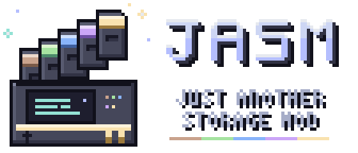

  

<b>Just Another Storage Mod</b>: portable, recoverable digital storage for Minecraft.

---

JASM stores your items as data on small chips called wafers. Carry them around in a handheld Deck, and back them up at an Archive, so a lost wafer can be rebuilt instead of gone for good.

## Features

- **Capacity Wafers**: storage chips in five sizes, from Basic up to 64K.
- **Type Wafers**: hold only a few kinds of items, but lots of each. Five sizes, from 4 types up to 64.
- **Decks**: handheld readers that hold several wafers at once, with a searchable storage screen. Five tiers, from Starter to Ultimate. The battery pays 1 FE for each item moved in or out; browsing is free. A new Crafting Deck links itself to the network of the Encoding Terminal you used last, and its tooltip and screen show whether it is linked.
- **Dimension Upgrade**: Decks work only in the Overworld until upgraded. Install one to use a Deck in the Nether, End or modded dimensions. Linked ports, crafting jobs and rules pause when the Deck or its network is outside the Overworld without the upgrade; the upgrade slot stays accessible.
- **Wafer filters**: right-click a wafer in the Deck to edit its ordered Item, Tag and Mod ID filters. Each row can Allow or Deny, be disabled, moved or removed. Wafers without filters accept everything; otherwise the first enabled matching row must Allow an item for it to enter. Wafers fill left to right, and higher Allow rows take space first when several item types arrive together.
- **Item ports**: cable-mounted Input Ports pull into a linked Deck, Output Ports push from it, and Input Output Ports do both with output first. Each direction has ordered Item, Tag and Mod ID filters. Empty input filters accept everything; empty output filters send nothing. Ports run twice per second while active and check once per second after five idle seconds. Four separate Speed Upgrade slots raise the item count per operation from 1 to 4, 16, 48 or 96 (2, 8, 32, 96 or 192 items per second). Upgrades stack normally in inventory and storage, with one allowed in each upgrade slot. All ports also have a Power Upgrade slot: with the upgrade, they supply FE to the machine they face.
- **Archives**: back up wafers and rebuild a lost one onto a blank. Shift-right-click with the linked Deck to back up its wafers in slot order, skipping those already backed up on the network. A short message shows the overall backed-up count. A standalone Archive works for its owner without a Terminal or paired Deck, and links the owner's held Deck automatically on its first backup. On a network it defaults to the network owner, who can select another trusted player's paired Deck. Trusted players can view the backups. Replacing a lost Deck for the same player keeps their backups.
- **Combustion Generators**: burn anything a furnace burns for power, in Basic, Advanced and Elite tiers. Each has a charging slot for Decks.
- **Crafting Decks**: Advanced, Elite and Ultimate Decks with a 3×3 crafting grid that takes ingredients straight from the wafers and refills itself.
- **Autocrafting**: write recipes onto Recipe Cards at an Encoding Terminal, keep them in Recipe Racks, and let Crafting Servers do the work. Ask for anything from your Crafting Deck, and the ingredients it needs are crafted first. Completed requested items return as each batch finishes; intermediate items stay with the job until it ends. A hammer in the Items tab marks items with a known recipe, even when some are already stored. Processors decide how many crafts run at once, Storage Modules how big a job fits. A job list on the Deck shows every job and opens its server from anywhere.
- **Machines**: put an Access Port next to furnaces, modded machines or a multiblock (every side counts), and write processing cards for it: what goes in, and up to three things that come back. Jobs send the ingredients in and wait for the results to come back into the port. Convert a port in a crafting grid to a thin cable attachment, or back again. Add a Power Upgrade to supply FE to attached machines. Each cable holds up to six thin ports, one per face, and a thin port can also go straight onto a machine with no cable. It stays off the network until you place a cable into its space; the port stays put. Each port serves and accepts items only through its outward face, including from pipes and hoppers while idle. Choose several machines and the work is shared between them.
- **Item intake**: full-block Access Ports also accept items from any face, even without a crafting job. Both forms have an eight-slot buffer for manual input and a Deck-link panel. Ordinary items go to the network owner's paired Deck, or another paired Deck selected in the port. Items wait when the Deck is unavailable or full. Crafting returns go to their job first.
- **Crafting rules**: "when I have fewer than 16 torches, craft 32" or "every minute, craft 8 bread", set on the Crafting Deck, with the results sent to the Deck or straight into your inventory.
- **Data Cables**: join the crafting blocks and carry power between them, in three tiers: Data Cable (1,000 FE/t), Advanced (10,000 FE/t) and Elite (50,000 FE/t). Each cable passes power on at its own speed, so a slower cable only slows the power that goes through it. Different players' networks never join.
- **Crystals and chips**: grow Data Crystals from seeded amethyst, cut them into Blank Chips, and cook and cool them into Logic and Memory Chips, the parts JASM's recipes are made of. The Crystal Foundry grows crystals in bulk, and a Crystal Resonator speeds up seeded amethyst.
- **Chip Workshop and Bitlings**: a little robot helper works the Workshop, turning Blank Chips into Logic, Memory and Link Chips, and now and then a rare Advanced one. Bitlings learn from every chip they make and grow up into Nibblings and Bytelings. See [the guide](wiki/chips-and-bitlings.md).
- **Bitling Station**: put a Bitling in it and a little living copy roams around, hops, rests, and walks home to recharge on the pad. You can pet it.
- **Creative Battery**: unlimited power for creative worlds, with a charging slot.
- **Safe by design**: copied wafers stop working, a crash never duplicates items, and items from removed mods are kept until the mod comes back.

## Status

JASM is in early testing. Things will change between versions, so back up your worlds.

## Recipes

Every item except the Creative Battery is craftable in survival. The first tier uses vanilla items; higher tiers use JASM's own chips, from hand-made Logic and Memory Chips up to Advanced chips from the Chip Workshop. Each higher tier is crafted from the one below it, keeping everything it holds. See [all recipes](wiki/recipes.md).

## Requirements

- Minecraft 26.1.2
- NeoForge 26.1.2.109 or newer

The current release is JASM 0.5.1 for Minecraft 26.1.2. Development for 26.3 is paused, and its older releases are archived.

Optional minimum versions: JEI 29.37.0.99 and Jade 26.1.10+neoforge, using their Minecraft 26.1.2 builds.

Optional: with [JEI](https://www.curseforge.com/minecraft/mc-mods/jei) installed, you get all recipes, info pages and a fuel page for the generators, the Deck's grid works with JEI's recipe keys, and JEI's "+" fills the Crafting Deck's grid and the Encoding Terminal. With [Jade](https://www.curseforge.com/minecraft/mc-mods/jade), looking at an Archive, generator, crafting block, Chip Workshop or Crystal Foundry shows its details.

## Installing

Download `jasm-0.5.1+mc26.1.2.jar` from [Releases](https://github.com/Micolash54/JASM/releases) and put it in your `mods` folder.

Use a Minecraft 26.1.2 world. Downgrading a 26.3 save is not supported.

## License

JASM is licensed under [CC BY-NC-SA 4.0](LICENSE): you may share it and make your own versions, as long as you credit it, don't make money from it, and release your version under the same license.

**Modpacks**: as an additional permission on top of the license, you may include JASM, unchanged, in modpacks that are free to download, including packs that earn rewards from the platform they're published on (such as CurseForge rewards or Modrinth payouts). Packs that are sold, or kept behind a paywall, are not covered by this permission.
