# Recipes

The first tier of every item is made from vanilla items. From there on, recipes use JASM's own chips: hand-made Logic and Memory Chips first, then Link Chips, then Advanced chips from the Chip Workshop. Every higher tier needs the tier below it, and nothing it holds is lost on the way up.

## Capacity Wafers

The three wafers are used up. The new wafer holds all of their items and starts unlinked.

| Recipe | Item | Ingredients |
| --- | --- | --- |
| 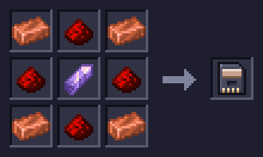 | **Basic Capacity Wafer** | 4 × Copper Ingot, 3 × Redstone, 1 × Amethyst Shard, 1 × Chest |
| 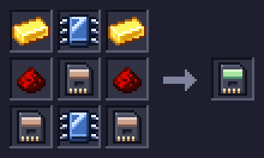 | **1K Capacity Wafer** | 2 × Gold Ingot, 2 × Memory Chip, 2 × Redstone, 3 × Basic Capacity Wafer |
| 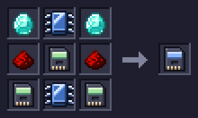 | **4K Capacity Wafer** | 2 × Diamond, 2 × Memory Chip, 2 × Redstone, 3 × 1K Capacity Wafer |
| 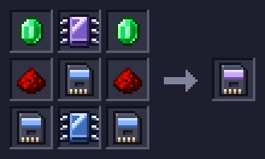 | **16K Capacity Wafer** | 2 × Emerald, 1 × Link Chip, 2 × Redstone, 3 × 4K Capacity Wafer, 1 × Memory Chip |
| 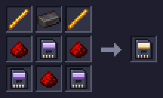 | **64K Capacity Wafer** | 2 × Blaze Rod, 2 × Advanced Memory Chip, 2 × Redstone, 3 × 16K Capacity Wafer |

## Type Wafers

Hold a few types, each in bulk. The two wafers are used up; the new wafer holds all of their items and starts unlinked.

| Recipe | Item | Ingredients |
| --- | --- | --- |
| 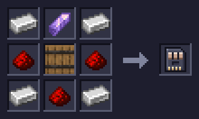 | **4 Type Wafer** | 4 × Iron Ingot, 3 × Redstone, 1 × Amethyst Shard, 1 × Barrel |
| 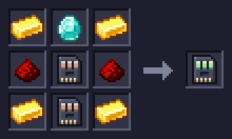 | **8 Type Wafer** | 4 × Gold Ingot, 1 × Memory Chip, 2 × Redstone, 2 × 4 Type Wafer |
| 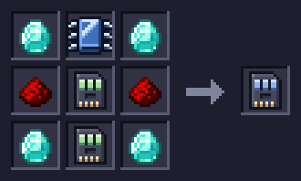 | **16 Type Wafer** | 4 × Diamond, 1 × Memory Chip, 2 × Redstone, 2 × 8 Type Wafer |
| 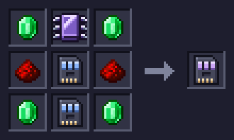 | **32 Type Wafer** | 4 × Emerald, 1 × Link Chip, 2 × Redstone, 2 × 16 Type Wafer |
| 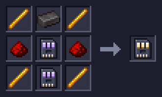 | **64 Type Wafer** | 4 × Blaze Rod, 1 × Advanced Memory Chip, 2 × Redstone, 2 × 32 Type Wafer |

## Decks

The old Deck is used up. The new one keeps its wafers and its charge.

| Recipe | Item | Ingredients |
| --- | --- | --- |
| 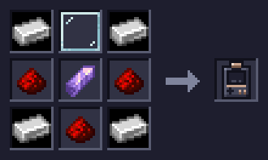 | **Starter Deck** | 4 × Iron Ingot, 1 × Glass Pane, 3 × Redstone, 1 × Amethyst Shard |
| 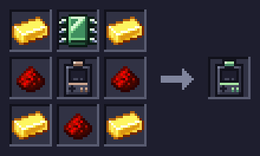 | **Basic Deck** | 4 × Gold Ingot, 1 × Logic Chip, 3 × Redstone, 1 × Starter Deck |
| 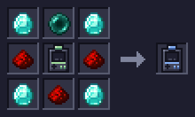 | **Advanced Deck** | 4 × Diamond, 1 × Link Chip, 3 × Redstone, 1 × Basic Deck |
| 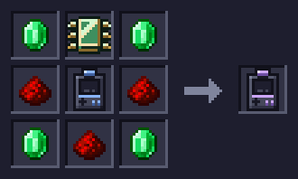 | **Elite Deck** | 4 × Emerald, 1 × Advanced Logic Chip, 3 × Redstone, 1 × Advanced Deck |
| 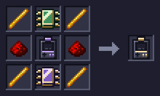 | **Ultimate Deck** | 4 × Blaze Rod, 1 × Advanced Logic Chip, 2 × Redstone, 1 × Elite Deck, 1 × Advanced Link Chip |

## Crafting Decks

A Deck with a crafting grid. Made from a Deck of the same tier, or upgraded from the Crafting Deck below; it keeps its wafers, charge and whatever is in its grid.

| Recipe | Item | Ingredients |
| --- | --- | --- |
| 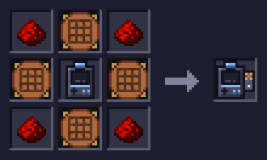 | **Advanced Crafting Deck** | 2 × Link Chip, 1 × Crafting Table, 1 × Fletching Table, 1 × Advanced Deck, 1 × Smithing Table, 2 × Redstone, 1 × Cartography Table |
| 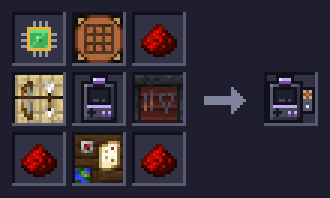 | **Elite Crafting Deck** | 1 × Advanced Logic Chip, 1 × Crafting Table, 3 × Redstone, 1 × Fletching Table, 1 × Elite Deck, 1 × Smithing Table, 1 × Cartography Table |
| 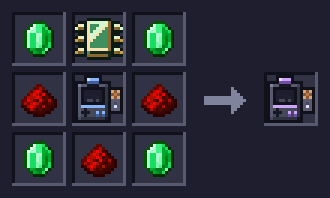 | **Elite Crafting Deck** | 4 × Emerald, 1 × Advanced Logic Chip, 3 × Redstone, 1 × Advanced Crafting Deck |
| 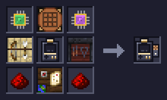 | **Ultimate Crafting Deck** | 1 × Advanced Logic Chip, 1 × Crafting Table, 1 × Advanced Link Chip, 1 × Fletching Table, 1 × Ultimate Deck, 1 × Smithing Table, 2 × Redstone, 1 × Cartography Table |
| 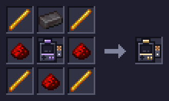 | **Ultimate Crafting Deck** | 4 × Blaze Rod, 1 × Advanced Logic Chip, 2 × Redstone, 1 × Elite Crafting Deck, 1 × Advanced Link Chip |

## Autocrafting

Recipe Cards hold recipes; the Encoding Terminal writes them; Recipe Racks hold them for the network; Crafting Servers run the jobs. Data Cables join it all and carry power. Eight cables around any dye give eight cables of that colour. A Filled Recipe Card crafted on its own turns back into an Empty Recipe Card.

| Recipe | Item | Ingredients |
| --- | --- | --- |
| 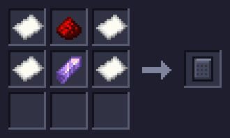 | **Empty Recipe Card** | 4 × Paper, 1 × Redstone, 1 × Amethyst Shard |
| 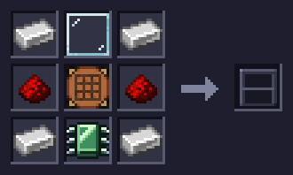 | **Encoding Terminal** | 4 × Iron Ingot, 1 × Glass Pane, 2 × Redstone, 1 × Crafting Table, 1 × Logic Chip |
| 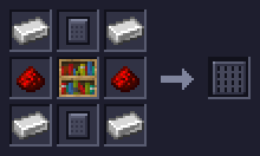 | **Recipe Rack** | 4 × Iron Ingot, 2 × Empty Recipe Card, 2 × Memory Chip, 1 × Bookshelf |
| 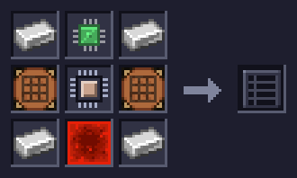 | **Crafting Server** | 4 × Iron Ingot, 1 × Logic Chip, 2 × Crafting Table, 1 × Basic Processor, 1 × Redstone Block |
| 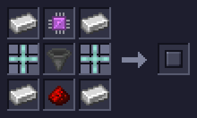 | **Access Port** | 4 × Iron Ingot, 1 × Link Chip, 2 × Data Cable, 1 × Hopper, 1 × Redstone |
| 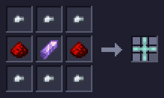 | **Data Cable** | 6 × Iron Nugget, 2 × Redstone, 1 × Amethyst Shard |
| 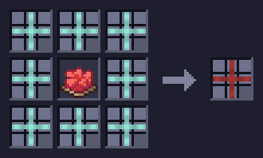 | **Red Data Cable** | 8 × Data Cable (any colour), 1 × Red Dye |

## Processors and Storage Modules

They go in a Crafting Server. Each Processor tier is made from four of the one below.

| Recipe | Item | Ingredients |
| --- | --- | --- |
| 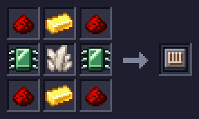 | **Basic Processor** | 4 × Redstone, 2 × Gold Ingot, 2 × Logic Chip, 1 × Quartz |
| 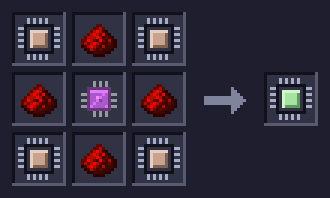 | **Advanced Processor** | 4 × Basic Processor, 4 × Redstone, 1 × Link Chip |
| 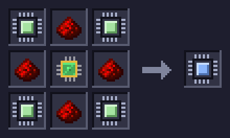 | **Elite Processor** | 4 × Advanced Processor, 4 × Redstone, 1 × Advanced Logic Chip |
| 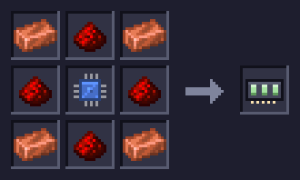 | **1k Storage Module** | 4 × Copper Ingot, 4 × Redstone, 1 × Memory Chip |
| 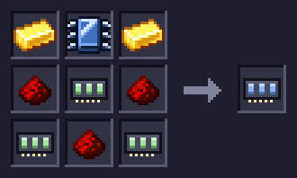 | **4k Storage Module** | 2 × Gold Ingot, 1 × Memory Chip, 3 × Redstone, 3 × 1k Storage Module |
| 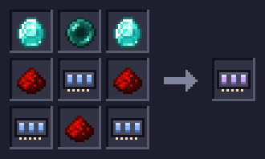 | **16k Storage Module** | 2 × Diamond, 1 × Link Chip, 2 × Redstone, 3 × 4k Storage Module, 1 × Memory Chip |
| 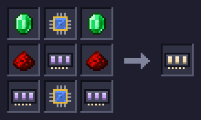 | **64k Storage Module** | 2 × Emerald, 2 × Advanced Memory Chip, 2 × Redstone, 3 × 16k Storage Module |

## Archives

The old Archive is used up. The new one keeps its links, owner and charge.

| Recipe | Item | Ingredients |
| --- | --- | --- |
| 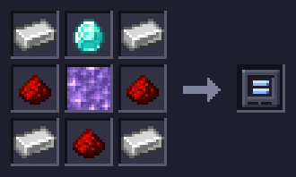 | **Basic Archive** | 4 × Iron Ingot, 1 × Memory Chip, 3 × Redstone, 1 × Amethyst Block |
| 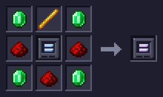 | **Advanced Archive** | 4 × Emerald, 1 × Link Chip, 3 × Redstone, 1 × Basic Archive |
| 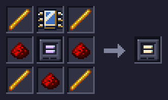 | **Ultimate Archive** | 4 × Blaze Rod, 1 × Advanced Memory Chip, 3 × Redstone, 1 × Advanced Archive |

## Combustion Generators

The old generator is used up. The new one keeps its stored power.

| Recipe | Item | Ingredients |
| --- | --- | --- |
| 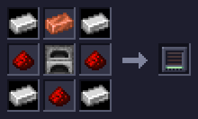 | **Basic Combustion Generator** | 4 × Iron Ingot, 1 × Copper Ingot, 3 × Redstone, 1 × Furnace |
| 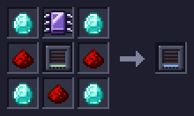 | **Advanced Combustion Generator** | 4 × Diamond, 1 × Link Chip, 3 × Redstone, 1 × Basic Combustion Generator |
| 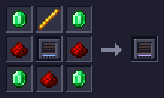 | **Elite Combustion Generator** | 4 × Emerald, 1 × Advanced Logic Chip, 3 × Redstone, 1 × Advanced Combustion Generator |

## Crystals and chips

Use a Crystal Seed on a Block of Amethyst to make Seeded Amethyst; it grows Data Crystal clusters. A Stonecutter cuts each Data Crystal into a Blank Chip. Cook a Blank Chip on a Campfire or in a Blast Furnace, then drop it in water to cool it into a Logic or Memory Chip. The Crystal Foundry grows 16 Blank Chips from every seed. Link Chips and Advanced chips come only from the Chip Workshop.

| Recipe | Item | Ingredients |
| --- | --- | --- |
| 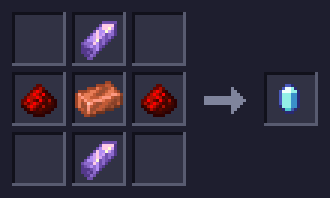 | **Crystal Seed** | 2 × Amethyst Shard, 2 × Redstone, 1 × Copper Ingot |
| 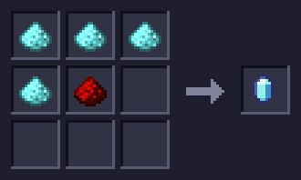 | **Crystal Seed** | 4 × Crystal Dust, 1 × Redstone |
| 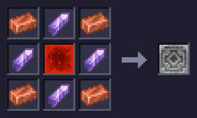 | **Crystal Resonator** | 4 × Copper Ingot, 4 × Amethyst Shard, 1 × Redstone Block |
| 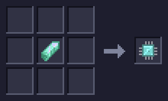 | **Blank Chip** | 1 × Data Crystal (Stonecutter) |
| 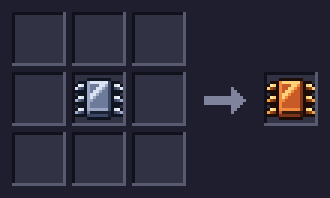 | **Unquenched Logic Chip** | 1 × Blank Chip (Campfire) |
| 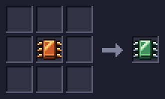 | **Logic Chip** | 1 × Unquenched Logic Chip (dropped in water) |
| 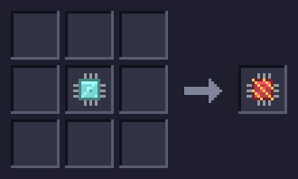 | **Unquenched Memory Chip** | 1 × Blank Chip (Blast Furnace) |
| 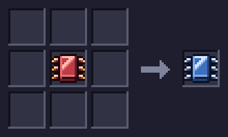 | **Memory Chip** | 1 × Unquenched Memory Chip (dropped in water) |
| 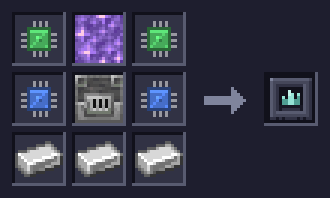 | **Crystal Foundry** | 2 × Logic Chip, 1 × Amethyst Block, 2 × Memory Chip, 1 × Blast Furnace, 3 × Iron Ingot |

## Bitlings and the Chip Workshop

A Bitling in the Chip Workshop turns Blank Chips into chips. A Basic Bitling becomes a Logic, Memory or Link Bitling with chips of that type and keeps its charge. A Bitling or Nibbling with a full training bar grows up into the next stage; training starts again. The Bitling Station lets one of them roam around it.

| Recipe | Item | Ingredients |
| --- | --- | --- |
| 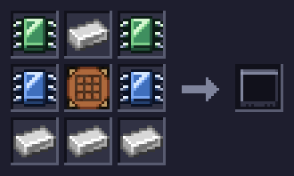 | **Chip Workshop** | 2 × Logic Chip, 4 × Iron Ingot, 2 × Memory Chip, 1 × Crafting Table |
|  | **Bitling Station** | 1 × Logic Chip, 6 × Iron Ingot, 1 × Memory Chip, 1 × Crystal Resonator |
|  | **Basic Bitling** | 4 × Logic Chip, 4 × Memory Chip, 1 × Iron Ingot |
|  | **Logic Bitling** | 8 × Logic Chip, 1 × Basic Bitling |
|  | **Memory Bitling** | 8 × Memory Chip, 1 × Basic Bitling |
|  | **Link Bitling** | 8 × Link Chip, 1 × Basic Bitling |
|  | **Logic Nibbling** | 7 × Logic Chip, 1 × Diamond, 1 × Logic Bitling (needs a full training bar) |
|  | **Memory Nibbling** | 7 × Memory Chip, 1 × Diamond, 1 × Memory Bitling (needs a full training bar) |
|  | **Link Nibbling** | 7 × Link Chip, 1 × Diamond, 1 × Link Bitling (needs a full training bar) |
|  | **Logic Byteling** | 7 × Advanced Logic Chip, 1 × Netherite Scrap, 1 × Logic Nibbling (needs a full training bar) |
|  | **Memory Byteling** | 7 × Advanced Memory Chip, 1 × Netherite Scrap, 1 × Memory Nibbling (needs a full training bar) |
|  | **Link Byteling** | 7 × Advanced Link Chip, 1 × Netherite Scrap, 1 × Link Nibbling (needs a full training bar) |

The Creative Battery has no recipe: it is for creative worlds only.
